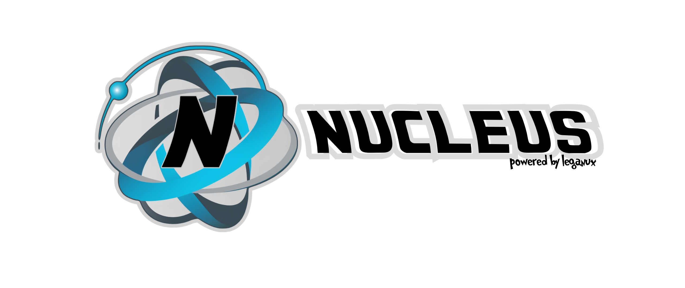

¡Bienvenido a "Nucleus", tu plataforma integral de desarrollo todo en uno, centrada principalmente en herramientas de desarrollo como Node.js!

"Nucleus", desarrollado por Leganux, fusiona soluciones tecnológicas desarrolladas a lo largo del tiempo para ofrecerte un desarrollo sólido, seguro y sin complicaciones.

Esta poderosa herramienta se basa en tecnologías JavaScript de Node, incluyendo Express, Mongoose, Moment, Crypto, entre otras. Sin embargo, lo que hace que "Nucleus" sea único es su capacidad para permitirte crear tus propias plantillas y templates, no solo para código JavaScript, sino también para cualquier otro lenguaje de tu elección.

Inicialmente concebido como un gestor de plantillas universal, "Nucleus" proporciona plantillas prediseñadas para una variedad de proyectos, tales como API, servicios web con autenticación automatizada, y paneles de administración.

La plantilla inicial incluye integraciones predeterminadas de herramientas como Apiato, Mongoose, MongoDB, autenticación, gestión de sesiones y tokens, control de usuarios, entre otros.

Además, "Nucleus" te permite incorporar otros elementos, como "3 comas" y "Hooli Logger", como templates adicionales.

Para obtener más información, te invitamos a consultar nuestra documentación. ¡Bienvenido a la revolución de la programación sin boilerplate con "Nucleus"!
